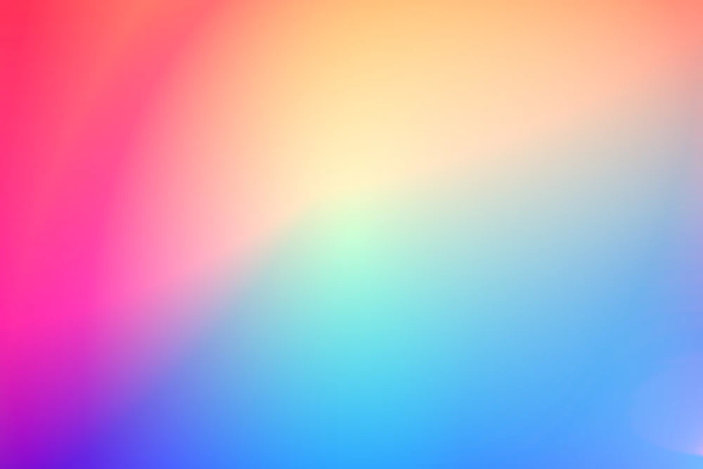
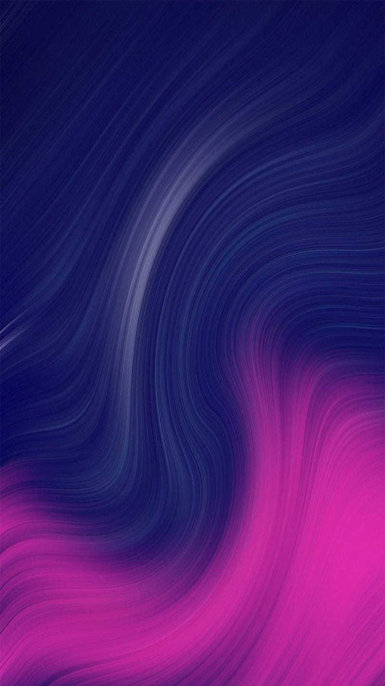
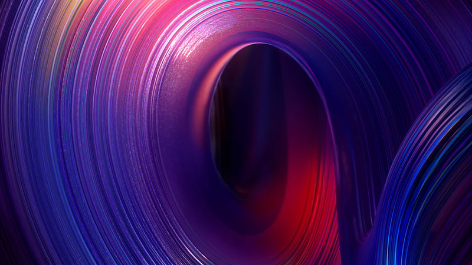
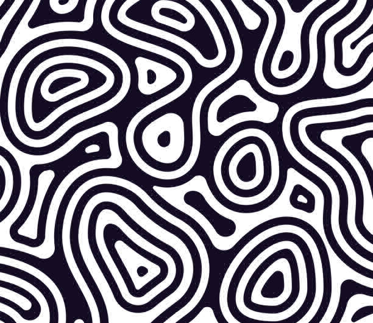
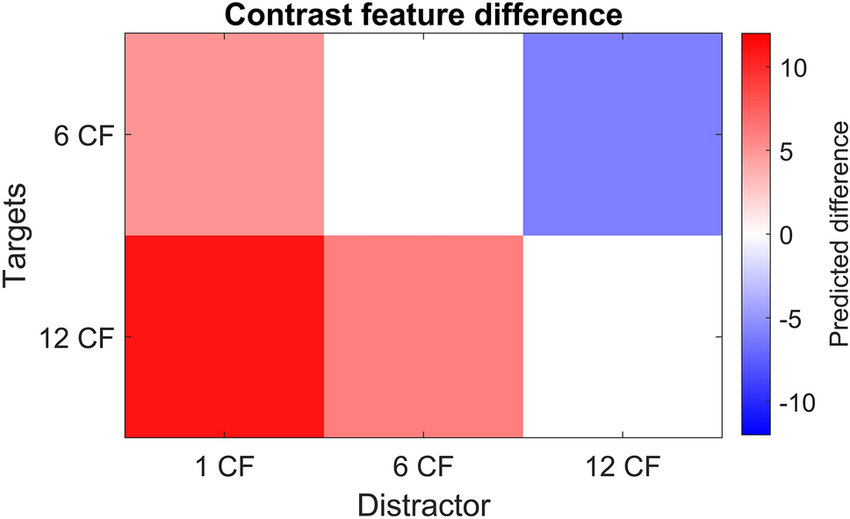

## Описание модуля для сжатия изображений
В качестве инструментов в модуле `compression` предоставляются три метода сжатия, представленные тремя классами:
 - `WithNumpySvdCompressor`;
 - `PowerSvdCompressor`;
 - `BlockPowerSvdCompressor`;

Представляющие сжатие путём разложения в `SVD` тремя методами соответсвенно:
 - с использованием `np.linalg.svd`;
 - с использованием степенного метода;
 - с использованием блочного степенного метода.

Предполагается, что последние 2 ограничиваются некоторым временем заданным в секундах.

Для хранения данных глобально используются два класса:
 - `Svd` – для хранения `SVD` разложения одного цвета;
 - `ImgCompressed` – для хранения непосредственно данных сжатого изображения, необходимых для востановления в `BMP` формат, в том числе включающие экземпляры `Svd` для каждого цвета;

Каждый из этих двух классов предоставляет методы `to_bytes` и `from_bytes`, тем самым позволяют сохранять сжатое изображения в файл посредством записи или чтения `bytes`.

Для хранения чисел в матрице используется тип `numpy.float32`, а также, то что для восстановления приходится хранить размеры оригинальной матрицы, размеры итогового файла при оригинальных размерах `m * n` составляют `4 + 3 * 4 * k * (m + n + 1)`, где `k` размер средней матрицы в разложении.

Таким образом, при сжатии в `ratio` раз `k` считается по следующей формуле: `k = ((src_img_size / ratio) - 4) / (3 * 4 * (m + n + 1))`.

## Эксперимент
Для честности, степенной и блочно-степенной методы ограничиваются временем работы методом, использующим разложение предоставленной библиотекой `numpy`.

Изображения сжимались в 5 раз.

### Градиент

original| numpy                               | power                               | block power                          
-|-------------------------------------|-------------------------------------|--------------------------------------
|  |  | 
|  |  | 

Напрашивается закономерный вывод: глаз не чувствует сжатие на градиентах.

### Кривые линии
Давайте посмотрим на изображения с похожей структурой (для нас), отличием будет более резкие границы цветов.

original| numpy                               | power                               | block power                          
-|-------------------------------------|-------------------------------------|--------------------------------------
|  |  | 
|  |  | 

И тут можно заметить, что сжатым изображениям становится не очень хорошо после конвертации обратно в `bmp`. Складывается впечатление, что это происходит из-за резких границ цветов.

### Контрастные фото
Проверим предположение, взяв в качестве исходных фото контрастные изображения.

original| numpy                               | power                               | block power                          
-|-------------------------------------|-------------------------------------|--------------------------------------
|  |  | 
|  |  | 
|  |  | 

Складывается впечатление, что так оно и есть, предположение верно, ну почти.
Третье сравнение наводит на мысль что прямые линии в отличие от кривых сохраняются лучше.

### Геометрические фигуры

original| numpy                               | power                               | block power                          
-|-------------------------------------|-------------------------------------|--------------------------------------
|  |  | 

На примере фигур можно заметить, что в местах "без отражений" методы справились с прямыми линиями лучше, особенно это заметно на квадрате.
### Ч/б

С самого начала мы полагались на цвета, что же будет с ч/б фото? Отношение `RGB` в каждой точке будет`1:1:1`, будет ли оно сохраняться на сложных фото? Конечно, не сложно догадаться, что будет, однако по-прежнему остаётся вопрос, что будет с визуальным качеством.

original| numpy                               | power                               | block power                          
-|-------------------------------------|-------------------------------------|--------------------------------------
|  |  | 
|  |  | 

Как ни странно, ситуация примерно такая же как была раньше довольно чётко сохранились в основонм только прямые линии. Небо которое могло выступить в качестве градиента пережило сжатие не так удачно, вероятно из-за высокого разрешения неискусственных фото.

Теперь, произведя анализ сжатия путём `SVD` декомпоции, можно сравнить методы друг с другом. Они запускались с примерно одинаковой продолжительностью и можно сказать, что на сжатии в 5 раз различия не то чтобы бросаются в глаза, и нельзя выделить фаворита.

Все запуски проводились на MacBook Air, M1, 2020, 8GB